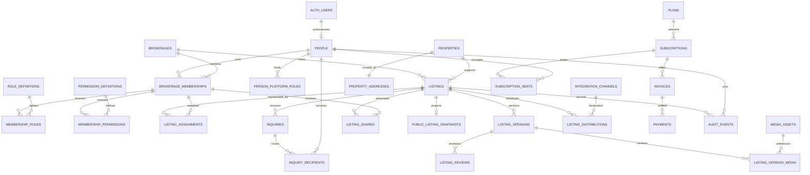

# SteadFast Database Design

**Version:** 0.1 - Planning Draft  
**Prepared:** July 2026  
**Status:** Target schema and data-security baseline  
**Platform:** PostgreSQL on Supabase with PostGIS  
**Applies to:** SteadFast MVP for Jamaican brokerages and agents

## 1. Purpose

This document defines the target relational database for SteadFast. It translates the approved product requirements, roles and permissions, and listing workflow into entities, keys, constraints, ownership rules, indexes, Row Level Security boundaries, storage relationships, audit history, migration practices, and recovery requirements.

This is a design document, not a migration. No production or Supabase schema changes are authorized by this document alone.

## 2. Current project note

The configured Supabase project is `steadfastrealty` with project reference `wtwvdweaunasdoyuafsb`. The connected tooling could retrieve current Supabase documentation but did not have permission to inspect the project's tables, extensions, or migrations. Before the first migration, engineering must inventory the live project and compare it with this target design. Existing objects and data must be preserved unless a reviewed migration explicitly changes them.

## 3. Design principles

1. **Brokerage-rooted isolation:** every brokerage-owned record carries `brokerage_id` directly or reaches it through an indexed parent relationship.
2. **Stable person identity:** one person may be a consumer, agent, broker staff member, broker, or SteadFast employee without duplicate accounts.
3. **Separate authentication from business identity:** Supabase `auth.users` authenticates; `public.people` represents the durable SteadFast person and may survive account deactivation or auth-provider changes.
4. **Immutable listing versions:** submitted and approved listing snapshots are never edited in place.
5. **Separate lifecycle and revision state:** listing publication state and proposed-version review state are distinct.
6. **Approved public projection:** anonymous users query sanitized public snapshot tables, not private listing source tables.
7. **Least privilege:** explicit database grants and RLS protect every table in an exposed schema.
8. **Defense in depth:** server authorization and database RLS both enforce permissions.
9. **No role decisions from user metadata:** user-editable Supabase metadata is never used for authorization.
10. **Opaque external identifiers:** business entities use UUID identifiers in URLs and APIs; append-only internal event tables may use `bigint identity` keys.
11. **Relational core, selective JSONB:** searchable and governed fields are typed columns. JSONB is reserved for variable property attributes, safe summaries, and external payload metadata.
12. **Exact time and money:** timestamps use `timestamptz`; money uses `numeric`, never floating point.
13. **Archive instead of destructive deletion:** listing, approval, assignment, billing, and audit history is retained.
14. **Portable migrations:** every schema change is reviewed SQL committed to Git and reproducible on standard PostgreSQL where practical.

## 4. Database schemas

| Schema | Exposure | Contents |
|---|---|---|
| `auth` | Supabase-managed, not exposed through the Data API | Authentication users, sessions, identities, and MFA records. SteadFast references only supported primary keys. |
| `public` | Data API schema with explicit grants and RLS | Application business tables and sanitized public projections. No table is public merely because it is in this schema. |
| `private` | Not exposed through the Data API | Idempotency, outbox, security events, webhook receipts, sensitive integration references, and carefully reviewed authorization helpers. |
| `storage` | Supabase-managed | Object metadata protected by Storage policies. Application tables reference bucket and object path; they do not modify Storage internals directly. |
| `extensions` | Supabase-managed convention | PostGIS and other approved extensions. No SteadFast business tables are created here. |

## 5. Identifier and naming standard

- All identifiers use lowercase `snake_case` and are unquoted.
- Business-table primary keys are UUIDs. The application should generate time-ordered UUIDv7 values using a pinned, reviewed library; the database may temporarily use `gen_random_uuid()` if UUIDv7 support is not yet available.
- URLs, API payloads, logs, and exports use UUID business identifiers, never sequential database counters.
- High-volume private event tables may use `bigint generated always as identity` as an internal primary key plus a UUID correlation identifier where externally referenced.
- Foreign-key columns use `<entity>_id`.
- Timestamps end in `_at`; booleans begin with `is_` or `has_`; status values use lowercase text checked by constraints.
- Every mutable business table includes `created_at`, `updated_at`, and `lock_version` where optimistic concurrency is required.

## 6. Entity relationship diagram

The diagram shows the core authorization, listing, publication, inquiry, integration, billing, and audit relationships. Supporting tables below refine these domains.

## 7. Domain catalogue

| Domain | Primary tables | Responsibility |
|---|---|---|
| Identity | `people`, `consumer_profiles`, `professional_profiles` | Durable person identity and public/private profile separation. |
| Authorization | `role_definitions`, `permission_definitions`, `role_permissions`, `person_platform_roles` | Stable permission catalogue and SteadFast internal roles. |
| Brokerage | `brokerages`, `brokerage_memberships`, `membership_roles`, `membership_permissions`, `agent_applications` | One active brokerage relationship, multi-role accounts, delegated staff authority, applications, and departures. |
| Websites | `sites`, `site_domains`, `site_listing_preferences` | Agent and brokerage subdomains, branding, domains, and display preferences. |
| Geography | `countries`, `administrative_areas`, `localities`, `property_addresses` | Jamaica-first normalized geography and PostGIS coordinates. |
| Property and listing | `properties`, `listings`, `listing_assignments`, `listing_versions`, `listing_reviews`, `listing_state_events` | Brokerage ownership, agent representation, immutable versions, approval, and lifecycle. |
| Features and media | `feature_definitions`, `listing_version_features`, `media_assets`, `listing_version_media` | Structured features and safe upload/publication workflow. |
| Sharing and publication | `listing_shares`, `listing_share_events`, `publication_records`, `public_listing_snapshots` | Display-only sharing and sanitized public search/site projection. |
| Consumer and inquiries | `favorites`, `saved_searches`, `inquiries`, `inquiry_recipients` | Free consumer tools and dual-agent inquiry routing. |
| Notifications | `notifications`, `notification_deliveries` | In-app/email event delivery and retry history. |
| Billing | `plans`, `plan_limits`, `subscriptions`, `subscription_seats`, `invoices`, `invoice_lines`, `payments`, `billing_adjustments` | Professional seats, brokerage plans, capacity, invoicing, and pilot payments. |
| Flags and support | `flags`, `flag_events`, `support_cases`, `support_case_events` | Broker notification, operations follow-up, and customer-service records. |
| Integrations | `integration_channels`, `brokerage_channel_authorizations`, `listing_distributions`, `distribution_attempts`, `external_identifiers` | Authorized MLS/portal adapters and delivery traceability. |
| Audit and reliability | `audit_events`, `private.security_events`, `private.outbox_events`, `private.idempotency_keys`, `private.webhook_receipts` | Immutable business history, security monitoring, reliable background work, and duplicate suppression. |

## 8. Identity and authorization tables

### 8.1 `people`

| Field | Type | Rule |
|---|---|---|
| `id` | `uuid` | Primary key; opaque business identity. |
| `auth_user_id` | `uuid null` | Unique foreign key to `auth.users(id)`; `on delete set null` so required business history can survive auth-account removal. |
| `account_status` | `text` | Check: `invited`, `active`, `locked`, `inactive`, `closed`. |
| `display_name` | `text` | Required public-friendly name. |
| `legal_name` | `text null` | Restricted personal data; never public by default. |
| `primary_email` | `text null` | Normalized; restricted. Auth remains the credential authority. |
| `primary_phone` | `text null` | Normalized E.164 when available; restricted. |
| `locale` | `text` | Default `en-JM`. |
| `timezone` | `text` | Default Jamaica timezone policy; store IANA name. |
| `created_at`, `updated_at` | `timestamptz` | Required UTC timestamps. |

Do not place broker, staff, agent, or admin authorization in `auth.users.raw_user_meta_data`. Role and permission truth lives in relational tables.

### 8.2 Profile tables

| Table | Key fields | Rule |
|---|---|---|
| `consumer_profiles` | `person_id pk`, `marketing_consent_at`, `privacy_notice_version`, `preferences jsonb` | One optional consumer profile per person. Preferences may use JSONB because they are not authorization inputs. |
| `professional_profiles` | `person_id pk`, `public_slug`, `bio`, `photo_asset_id`, `service_areas`, `license_number`, `license_status`, `public_contact_preferences` | Public professional presentation. Verification remains brokerage responsibility in the MVP. Slug is globally unique and case-normalized. |

### 8.3 Role and permission catalogue

| Table | Key fields | Constraints |
|---|---|---|
| `role_definitions` | `key pk text`, `scope`, `name`, `is_system` | Seeded keys include `consumer`, `agent`, `broker_staff`, `broker`, `steadfast_operations`, `steadfast_admin`. |
| `permission_definitions` | `key pk text`, `scope`, `name`, `risk_level` | Seeded from the approved Roles and Permissions Matrix. Keys never change meaning after release. |
| `role_permissions` | `role_key`, `permission_key` | Composite primary key. Defines baseline role capabilities. |
| `person_platform_roles` | `person_id`, `role_key`, `granted_by_person_id`, `starts_at`, `ends_at`, `reason` | Only platform-scoped roles; high-risk changes require MFA and audit. |

## 9. Brokerage and membership tables

### 9.1 `brokerages`

| Field | Type | Rule |
|---|---|---|
| `id` | `uuid` | Primary key. |
| `slug` | `text` | Unique, lowercase public identifier. |
| `legal_name`, `display_name` | `text` | Legal and public company names. |
| `status` | `text` | Check: `pending`, `active`, `suspended_billing`, `inactive`, `closed`. Ordinary listing disputes do not change this field. |
| `country_id` | `uuid` | Launch value Jamaica; supports expansion. |
| `primary_office_address` | `jsonb null` | Company contact address; normalize into office tables later if multiple offices become MVP scope. |
| `branding` | `jsonb` | Non-authoritative colors and presentation settings. |
| `created_at`, `updated_at`, `closed_at` | `timestamptz` | Lifecycle timestamps. |
| `lock_version` | `integer` | Optimistic concurrency. |

### 9.2 Memberships and applications

| Table | Key fields | Constraints and behavior |
|---|---|---|
| `brokerage_memberships` | `id`, `brokerage_id`, `person_id`, `status`, `starts_at`, `ends_at`, `approved_by_person_id`, `deactivated_by_person_id`, `reason`, `lock_version` | Partial unique index permits only one active brokerage membership per person in the MVP. History remains after departure. |
| `membership_roles` | `membership_id`, `role_key`, `granted_by_person_id`, `starts_at`, `ends_at` | Composite active uniqueness. Brokerage role keys only. One active principal broker role per brokerage is enforced by partial unique index. |
| `membership_permissions` | `membership_id`, `permission_key`, `effect`, `granted_by_person_id`, `starts_at`, `ends_at` | Explicit staff grants or denials. A grantor cannot grant a permission they do not hold. |
| `agent_applications` | `id`, `person_id`, `brokerage_id`, `status`, `submitted_at`, `broker_decided_by`, `broker_decided_at`, `broker_reason`, `platform_activated_at` | Check states: `draft`, `submitted`, `broker_approved`, `broker_denied`, `activated`, `withdrawn`. SteadFast activation is account/service setup, not brokerage listing approval. |

Membership deactivation and listing unassignment must occur in one short, audited transaction or through a transaction plus reliable outbox that makes public unpublication fail closed.

## 10. Website tables

| Table | Key fields | Rules |
|---|---|---|
| `sites` | `id`, `site_type`, `owner_person_id null`, `owner_brokerage_id null`, `slug`, `status`, `branding jsonb`, `created_at`, `updated_at` | Check exactly one owner is present. `site_type` is `agent` or `brokerage`; owner type must match. Slug unique. |
| `site_domains` | `id`, `site_id`, `hostname`, `domain_type`, `verification_status`, `verified_at`, `is_primary` | Hostname globally unique. One primary domain per site. Start with SteadFast subdomains; custom domains later. |
| `site_listing_preferences` | `site_id`, `listing_id`, `display_source`, `is_visible`, `is_featured`, `sort_rank`, `updated_by_person_id` | Applies only to otherwise eligible owned/shared listings. Preferences cannot publish an ineligible listing. |

## 11. Plans, subscriptions, and billing

| Table | Key fields | Rules |
|---|---|---|
| `plans` | `id`, `key`, `name`, `subject_type`, `billing_interval`, `currency`, `price`, `status`, `version` | Version plan terms instead of overwriting historical price definitions. Initial reference prices are USD; JMD invoicing policy remains open. |
| `plan_limits` | `plan_id`, `limit_key`, `limit_value`, `unit` | Examples: agents, non-agent staff, active listings, shares, distribution channels. |
| `subscriptions` | `id`, `plan_id`, `person_id null`, `brokerage_id null`, `payer_person_id null`, `payer_brokerage_id null`, `status`, `starts_at`, `renews_at`, `grace_ends_at`, `ends_at` | Exactly one subscribed subject. Payer may differ from the professional subject. Status is `trial`, `active`, `grace`, `suspended`, `cancelled`, `ended`. |
| `subscription_seats` | `id`, `subscription_id`, `person_id`, `seat_type`, `starts_at`, `ends_at`, `funding_type` | Partial unique index allows one active professional seat per person even with multiple roles. |
| `invoices` | `id`, `subscription_id`, `invoice_number`, `currency`, `subtotal`, `tax_total`, `total`, `status`, `issued_at`, `due_at`, `paid_at` | Invoice number unique. Monetary totals non-negative and internally consistent. |
| `invoice_lines` | `id`, `invoice_id`, `description`, `quantity`, `unit_price`, `line_total`, `service_period_start`, `service_period_end` | Immutable after invoice finalization; corrections use adjustments. |
| `payments` | `id`, `invoice_id`, `amount`, `currency`, `method`, `provider_reference`, `status`, `received_at`, `recorded_by_person_id` | Provider reference unique when present. Pilot payments may be recorded by operations. |
| `billing_adjustments` | `id`, `invoice_id`, `amount`, `reason`, `created_by_person_id`, `created_at` | Append-only positive/negative adjustment; never delete billing history. |

## 12. Geography and property tables

### 12.1 Geography reference

| Table | Key fields | Rules |
|---|---|---|
| `countries` | `id`, `iso2`, `iso3`, `name`, `currency_code`, `is_active` | Jamaica seeded first; ISO codes unique. |
| `administrative_areas` | `id`, `country_id`, `type`, `code`, `name`, `boundary geometry null` | Jamaican parishes are initial area records. GiST index on boundary when loaded. |
| `localities` | `id`, `administrative_area_id`, `name`, `normalized_name`, `centroid geography` | Supports community/town search and clustering. |

### 12.2 `properties`

| Field | Type | Rule |
|---|---|---|
| `id` | `uuid` | Platform-canonical property identity. RLS prevents cross-brokerage discovery through private records. |
| `created_by_brokerage_id` | `uuid` | Provenance, not permanent property ownership. |
| `property_type` | `text` | Checked launch types: residential, commercial, land, development, with controlled subtypes. |
| `address_id` | `uuid` | Foreign key to exact normalized address. |
| `address_fingerprint` | `text` | Normalized duplicate-detection key; restricted from public access. |
| `duplicate_review_status` | `text` | `clear`, `possible_duplicate`, `reviewed_distinct`, `merged_reference`. Automatic detection never merges. |
| `created_at`, `updated_at` | `timestamptz` | Required. |

### 12.3 `property_addresses`

| Field | Type | Rule |
|---|---|---|
| `id` | `uuid` | Primary key. |
| `country_id`, `administrative_area_id`, `locality_id` | `uuid` | Indexed foreign keys. |
| `address_line_1`, `address_line_2`, `postal_code` | `text` | Exact address; private unless approved display precision permits. |
| `normalized_address` | `text` | Search and duplicate-detection form. |
| `location` | `geography(Point,4326)` | Exact geocoded point. GiST indexed. |
| `geocode_provider`, `geocode_reference`, `geocode_confidence` | `text`, `text`, `numeric` | Provider traceability and confidence. No provider secrets. |
| `verified_at`, `verified_by_person_id` | `timestamptz`, `uuid` | Broker workflow may verify; SteadFast does not verify documents in the MVP. |

Public snapshots store only the approved display label and approved public point. They do not expose exact private address fields by default.

## 13. Listing core tables

### 13.1 `listings`

| Field | Type | Rule |
|---|---|---|
| `id` | `uuid` | Primary key and public API identifier. |
| `brokerage_id` | `uuid` | Required immutable owning brokerage. Indexed and never transferred. |
| `property_id` | `uuid` | Required property relationship. |
| `lifecycle_state` | `text` | Check: `draft`, `pending_initial_approval`, `approved_inactive`, `active`, `under_offer`, `withdrawn`, `sold`, `rented`, `expired`, `unassigned`, `archived`. |
| `current_approved_version_id` | `uuid null` | Must reference an approved version belonging to the same listing. |
| `current_assignment_id` | `uuid null` | Must reference the one active assignment belonging to the same listing. |
| `published_at`, `unpublished_at`, `archived_at` | `timestamptz null` | Publication history also exists in events. |
| `created_by_person_id` | `uuid` | Original creator. |
| `created_at`, `updated_at` | `timestamptz` | Required. |
| `lock_version` | `integer` | Optimistic concurrency for lifecycle pointers. |

Use composite foreign-key techniques or reviewed constraint triggers to ensure current-version and current-assignment pointers belong to the same listing. These checks must not depend only on application code.

### 13.2 `listing_assignments`

| Field | Type | Rule |
|---|---|---|
| `id`, `listing_id` | `uuid` | Primary and indexed listing relationship. |
| `agent_membership_id` | `uuid` | Must identify an active agent role in the listing brokerage at activation time. |
| `status` | `text` | `proposed`, `active`, `ended`, `invalidated`. |
| `starts_at`, `ends_at` | `timestamptz` | Time-bounded assignment. |
| `assigned_by_person_id`, `ended_by_person_id`, `reason` | mixed | Full attribution. |

A partial unique index permits only one active assignment per listing. Membership deactivation invalidates all active assignments and moves affected listings to `unassigned` through an audited workflow.

### 13.3 `listing_versions`

| Field group | Fields and types | Rule |
|---|---|---|
| Identity | `id uuid`, `listing_id uuid`, `version_number integer`, `based_on_version_id uuid null` | Unique `(listing_id, version_number)`. Base version belongs to the same listing. |
| Review | `revision_state text`, `submitted_by_person_id uuid`, `submitted_at`, `frozen_at`, `approved_at` | States: `working_draft`, `submitted`, `changes_requested`, `rejected`, `approved`, `withdrawn`, `superseded`. Submitted/approved snapshots immutable. |
| Classification | `purpose text`, `property_type text`, `property_subtype text null`, `requested_lifecycle_state text null` | Controlled checks. Vacation/short-term purpose excluded. |
| Price | `currency char(3)`, `price numeric(14,2)`, `price_period text null` | Exact non-negative money; JMD/USD compatible. |
| Public copy | `title text`, `description text` | Runtime length/content validation; plain text or sanitized rich-text policy. |
| Core facts | `bedrooms smallint`, `bathrooms numeric(4,1)`, `building_area numeric`, `land_area numeric`, `area_unit text` | Non-negative checks; nullable where not applicable. |
| Visibility | `visibility text`, `public_location_precision text`, `public_location_label text`, `public_location geography(Point,4326) null` | Visibility: `private`, `professional_network`, `public`. Public point may be exact or approved approximate later. |
| Flexible facts | `attributes jsonb` | Property-type-specific facts only. Validate against application/database schema; add GIN or expression indexes only for actual query patterns. |
| Integrity | `content_hash text`, `changed_fields text[]`, `created_at`, `created_by_person_id` | Hash and changed fields support comparison/idempotency. |

A partial unique index enforces one open material proposal per listing across `working_draft` and `submitted`. A `changes_requested` snapshot is closed and immutable; the corrected work is a new `working_draft` based on it. Immutability triggers reject updates to submitted, approved, changes-requested, rejected, withdrawn, or superseded snapshots except tightly controlled system timestamps.

### 13.4 Reviews and state events

| Table | Key fields | Rules |
|---|---|---|
| `listing_reviews` | `id`, `listing_version_id`, `reviewer_person_id`, `reviewer_membership_id`, `decision`, `comment`, `is_self_approval`, `decided_at` | One final decision per submitted version. Decision: `approved`, `changes_requested`, `rejected`. Comments required for return/rejection. |
| `listing_state_events` | `id`, `listing_id`, `from_state`, `to_state`, `source_version_id`, `actor_person_id`, `reason`, `occurred_at` | Append-only lifecycle transition history. |

## 14. Features and media

| Table | Key fields | Rules |
|---|---|---|
| `feature_definitions` | `id`, `key`, `name`, `property_types`, `data_type`, `status` | Controlled feature catalogue for filters and international mapping. |
| `listing_version_features` | `listing_version_id`, `feature_id`, `value_text`, `value_numeric`, `value_boolean` | Composite key; exactly one value column appropriate to definition. |
| `media_assets` | `id`, `brokerage_id`, `created_by_person_id`, `source_bucket`, `source_object_path`, `public_bucket null`, `public_object_path null`, `mime_type`, `byte_size`, `checksum`, `scan_status`, `width`, `height`, `created_at` | Server-generated paths; allowlisted MIME/content; size checks; scan before public derivative. Unique bucket/path. |
| `listing_version_media` | `listing_version_id`, `media_asset_id`, `media_role`, `sort_order`, `caption`, `alt_text` | Unique version/asset and sort order. Submitted version media order is immutable. |

Use a private source bucket for drafts and a separate public derivative bucket for approved, scanned media. Removing approval or eligibility removes the public derivative/reference while retaining the governed source under retention policy. Storage upsert policies require insert, select, and update permission; delete remains server-controlled.

## 15. Sharing and publication

### 15.1 Sharing

| Table | Key fields | Rules |
|---|---|---|
| `listing_shares` | `id`, `listing_id`, `granting_assignment_id`, `displaying_membership_id`, `status`, `granted_at`, `accepted_at`, `ended_at`, `ended_by_person_id`, `end_reason` | Status: `offered`, `active`, `declined`, `removed`, `revoked`, `suspended`, `ended`. Unique open share per listing/displaying agent. No content or ownership fields. |
| `listing_share_events` | `id`, `listing_share_id`, `event_type`, `actor_person_id`, `details jsonb`, `occurred_at` | Append-only notification and history source. Safe details only. |

### 15.2 Publication

| Table | Key fields | Rules |
|---|---|---|
| `publication_records` | `id`, `listing_id`, `surface`, `site_id null`, `status`, `approved_version_id`, `published_at`, `removed_at`, `removal_reason` | Surfaces: marketplace, professional network, agent site, brokerage site, shared agent site. Idempotent unique active target. |
| `public_listing_snapshots` | `listing_id pk`, `approved_version_id`, safe searchable/display fields, `brokerage_id`, `assigned_agent_person_id`, `public_point`, `search_vector`, `published_at`, `updated_at` | Sanitized anonymous projection. Contains no exact private address, drafts, review comments, internal notes, or audit data. Rebuilt only from eligible approved state. |

Anonymous database grants are limited to approved public site/profile/snapshot data and safe inquiry creation paths. Public search never joins raw listing versions or exact address tables.

## 16. Consumer, inquiry, and notification tables

| Table | Key fields | Rules |
|---|---|---|
| `favorites` | `person_id`, `listing_id`, `created_at` | Composite primary key. RLS owner-only. Unavailable listings preserve a safe reference without private content. |
| `saved_searches` | `id`, `person_id`, `name`, typed common filters, `filters jsonb`, `alerts_enabled`, `created_at`, `updated_at` | Owner-only. Common filters typed; less common filter definition may use validated JSONB. |
| `inquiries` | `id`, `listing_id`, `listing_version_id`, `source_site_id`, `consumer_person_id null`, `visitor_name`, `visitor_email`, `visitor_phone`, `message`, `consent_at`, `privacy_notice_version`, `status`, `created_at` | Captures the exact approved listing version and source. PII is restricted, minimized, and never public. Anti-abuse controls required. |
| `inquiry_recipients` | `inquiry_id`, `person_id`, `recipient_role`, `is_primary`, `delivery_status`, `acknowledged_at`, `handled_at` | Selected agent primary; other relevant agent secondary. Composite key. Recipient-only content access, brokerage aggregate only under approved policy. |
| `notifications` | `id`, `person_id`, `event_type`, `title`, `body_safe`, `target_type`, `target_id`, `read_at`, `created_at` | RLS owner-only. Target authorization is rechecked when opened. |
| `notification_deliveries` | `id`, `notification_id`, `channel`, `destination_masked`, `status`, `attempt_count`, `last_attempt_at`, `provider_reference`, `error_code` | No raw provider secrets or unnecessary destination values. |

## 17. Flags and support

| Table | Key fields | Rules |
|---|---|---|
| `flags` | `id`, `listing_id null`, `person_id null`, `brokerage_id`, `category`, `source`, `status`, `evidence_reference`, `created_by_person_id`, `created_at` | At least one target. An ordinary flag does not change listing lifecycle. |
| `flag_events` | `id`, `flag_id`, `event_type`, `actor_person_id`, `comment`, `occurred_at` | Tracks broker notification, response, follow-up, and closure. |
| `support_cases` | `id`, `requester_person_id`, `brokerage_id null`, `category`, `priority`, `status`, `assigned_operations_person_id`, `created_at`, `closed_at` | Operations access only for assigned service purpose. |
| `support_case_events` | `id`, `support_case_id`, `actor_person_id`, `event_type`, `message`, `created_at` | Append-only case history; secrets prohibited. |

## 18. Integration tables

| Table | Key fields | Rules |
|---|---|---|
| `integration_channels` | `id`, `key`, `name`, `status`, `adapter_version`, `requires_authorization`, `configuration_schema jsonb` | Initial planned keys: RAJ/MLS and Realtor.com International/Move. A channel record does not imply permission to distribute. |
| `brokerage_channel_authorizations` | `id`, `brokerage_id`, `channel_id`, `status`, `agreement_reference`, `starts_at`, `ends_at`, `approved_by_person_id` | Written authorization and eligibility period. No secret credential values. |
| `listing_distributions` | `id`, `listing_id`, `channel_id`, `approved_version_id`, `eligibility_status`, `delivery_status`, `external_identifier null`, `last_success_at`, `last_error_code` | Unique listing/channel relationship. Only current approved eligible version may send. |
| `distribution_attempts` | `id bigint identity`, `correlation_id uuid`, `distribution_id`, `attempt_type`, `idempotency_key`, `request_summary jsonb`, `response_summary jsonb`, `status`, `attempted_at` | Append-only. Summaries are redacted; raw payload retention is separate and time-limited if needed. |
| `external_identifiers` | `id`, `channel_id`, `entity_type`, `internal_id`, `external_id`, `valid_from`, `valid_to` | Unique active destination identifier. External IDs never become SteadFast primary keys. |
| `private.integration_secret_refs` | `id`, `brokerage_id null`, `channel_id`, `secret_provider`, `secret_reference`, `rotated_at` | Stores only Vault/secret-manager references. Values are never returned after entry. |

## 19. Audit and reliability tables

### 19.1 `audit_events`

| Field | Type | Rule |
|---|---|---|
| `id` | `bigint identity` | Internal append order. |
| `event_id` | `uuid` | Unique public-safe reference. |
| `actor_person_id` | `uuid null` | Null only for attributable system events. |
| `effective_role_key` | `text null` | Role used for the action. |
| `brokerage_id` | `uuid null` | Tenant context when applicable. |
| `action` | `text` | Stable event key. |
| `target_type`, `target_id` | `text`, `uuid null` | Business target. |
| `source`, `correlation_id` | `text`, `uuid` | Request/job/integration trace. |
| `reason` | `text null` | Required for designated decisions. |
| `before_summary`, `after_summary` | `jsonb null` | Allowlisted safe fields only; never credentials or full PII. |
| `occurred_at` | `timestamptz` | Immutable UTC time. |

No application role receives update or delete privileges on audit events. Agents see only relevant safe events; brokerage reviewers see their brokerage; platform security receives broader audited access.

### 19.2 Private reliability tables

| Table | Key fields | Rules |
|---|---|---|
| `private.outbox_events` | `id bigint identity`, `event_id uuid`, `topic`, `aggregate_type`, `aggregate_id`, `payload jsonb`, `available_at`, `claimed_at`, `completed_at`, `attempt_count`, `last_error` | Written in the same transaction as approval/publication state. Workers claim with short transactions and safe retry. |
| `private.idempotency_keys` | `scope`, `key`, `request_hash`, `response_reference`, `status`, `expires_at` | Unique `(scope,key)`. Prevents duplicate decisions, shares, inquiries, and feed sends. |
| `private.security_events` | `id bigint identity`, `person_id null`, `event_type`, `severity`, `request_reference`, `network_summary`, `details_safe`, `occurred_at` | Restricted internal monitoring. Sensitive network details follow short retention. |
| `private.webhook_receipts` | `id bigint identity`, `channel_id`, `external_event_id`, `body_hash`, `signature_valid`, `received_at`, `processed_at` | Unique destination/event. Raw bodies retained only when required and protected. |

## 20. Critical constraints

| Constraint | Enforcement |
|---|---|
| One active brokerage membership per person | Partial unique index on `brokerage_memberships(person_id)` where status is active. |
| One active principal broker per brokerage | Partial unique index across active `membership_roles` joined/denormalized with brokerage identifier; implement with a protected assignment function if cross-table uniqueness is required. |
| One active assignment per listing | Partial unique index on `listing_assignments(listing_id)` where status is active. |
| One open material proposal per listing | Partial unique index on `listing_versions(listing_id)` where `revision_state in ('working_draft','submitted')`. Returned snapshots remain historical while a replacement working draft is created. |
| Version belongs to listing | Foreign key plus unique `(listing_id, version_number)` and same-listing base-version check. |
| Current approved pointer is valid | Composite foreign key or constraint trigger verifies version belongs to listing and state is approved. |
| Assigned agent belongs to owner brokerage | Transaction function verifies active membership, agent role, and matching brokerage before assignment activation. |
| Public listing has eligible representative | Publication projection function requires active assignment and membership. |
| Dual-role person pays once | Partial unique active professional `subscription_seats(person_id)`. |
| Site has one valid owner | Check constraint on owner columns plus type/owner consistency. |
| Subscription has one subject | Check exactly one of person or brokerage subject is set. |
| Submitted/approved versions immutable | Trigger rejects content updates after freeze. |
| Audit and state events append-only | Revoke update/delete; optional trigger rejects mutation even for normal application roles. |
| Money and quantities valid | Numeric checks for non-negative price, totals, dimensions, and counts. |

PostgreSQL does not support `add constraint if not exists`; migrations must check `pg_constraint` or use deterministic one-time migrations.

## 21. Row Level Security strategy

RLS is enabled on every table in the exposed `public` schema. Policies specify `to anon` or `to authenticated`; `to authenticated` alone is never treated as authorization.

| Data group | Anonymous | Consumer | Brokerage professional | Operations | Admin/system |
|---|---|---|---|---|---|
| Public snapshots/sites/profiles | Select eligible public rows only. | Same public access. | Same public access. | Same plus assigned support views. | Controlled platform access. |
| Consumer profile/favourites/searches | None. | Own rows using `(select auth.uid())` mapped to person. | Own consumer rows only. | Support-limited, masked. | Audited controlled access. |
| Brokerage membership | None. | Own application/status only. | Rows inside active brokerage, limited by role/permission. | Support context only. | Audited platform access. |
| Listing source/version/review | None. | None. | Owning brokerage and assignment/review permission rules. | No ordinary listing decision access. | Security/support access only through controlled server path. |
| Inquiries | Insert through validated server/limited path. | Own submitted history. | Recipient content; brokerage aggregate only under approved permission. | Delivery/support context only. | Audited controlled access. |
| Billing | None. | Own professional subscription. | Own subscription or delegated brokerage billing. | Assigned billing function. | Audited platform billing access. |
| Audit | None. | None except own safe history where required. | Relevant safe brokerage/listing events. | Assigned support/billing events. | Restricted security/admin access. |

Policy rules:

- Index every `person_id`, `brokerage_id`, membership, status, and target column used by RLS.
- Wrap stable request functions as `(select auth.uid())` so they are evaluated once per statement.
- Update policies include both `using` and `with check`, plus a matching select policy.
- Views exposed to API roles use `security_invoker = true`; sensitive views remain in an unexposed schema or are not granted.
- Authorization helpers, if needed, live in `private`, set `search_path = ''`, explicitly check the caller, and receive the minimum execute grants.
- `security definer` is never added merely to make a permission error disappear.
- Service-role/secret keys remain server-only and are never placed in `NEXT_PUBLIC_*` variables.
- JWT claims may assist session assurance checks, but mutable user metadata never decides tenant membership or permissions.
- High-risk platform operations require current MFA assurance and server-side revalidation.

## 22. Storage security

| Bucket | Access | Purpose |
|---|---|---|
| `listing-private` | Private | Original draft photos, floor plans, and documents before approval/scanning. |
| `listing-public` | Public read, server-controlled write | Approved, scanned, transformed public listing media only. |
| `profile-private` | Private | Original profile uploads before moderation/processing. |
| `profile-public` | Public read, server-controlled write | Approved public avatars and logos. |
| `support-private` | Private, operations-controlled | Evidence or attachments for support/flags; never public listing media. |

Object paths are server-generated and include opaque brokerage/listing/asset identifiers. Policies validate ownership using database records, not user-supplied path text alone. File type is checked by content, MIME allowlist, extension, size, dimensions, and malware-scan state. Active HTML/SVG or executable content is not served inline without an explicit sanitization policy.

## 23. Index strategy

| Query pattern | Recommended index |
|---|---|
| Active brokerage membership lookup | Partial B-tree on `(person_id)` where status is active; B-tree on `(brokerage_id,status)`. |
| Approval queue | Composite B-tree on listing/version `(brokerage_id,revision_state,submitted_at)` through denormalized/indexable ownership. Equality columns first, time last. |
| Agent's listings | B-tree on active assignments `(agent_membership_id,status,starts_at desc)`. |
| Public listing filters | Composite/partial indexes on public snapshot `(purpose,property_type,price,listing_id)` limited to active rows. Add purpose-specific indexes based on measured queries. |
| Map viewport and proximity | GiST on `public_point` and exact private `location`. |
| Area search | B-tree on `administrative_area_id`, `locality_id`; GiST on boundaries when loaded. |
| Text search | Stored `tsvector` plus GIN on approved public title/description/location terms. |
| JSONB property attributes | GIN `jsonb_path_ops` for measured containment queries; expression indexes for frequent specific keys. Do not index all JSONB speculatively. |
| Share lookup | Partial unique/B-tree on `(listing_id,displaying_membership_id)` for open states. |
| Inquiry inbox | Composite B-tree on `(person_id,delivery_status,created_at desc)` through recipients. |
| Distribution worker | Partial B-tree on `(delivery_status,available_at)` for pending/retry work. |
| Audit history | B-tree on `(brokerage_id,occurred_at desc)`, `(target_type,target_id,occurred_at desc)`, and BRIN on `occurred_at` when volume justifies it. |

Every foreign-key column is indexed unless a documented low-cardinality/access-pattern analysis proves it unnecessary. Actual indexes are validated with `explain (analyze,buffers)` using representative data before launch.

## 24. Public search and map queries

- Public reads use `public_listing_snapshots`, not raw version tables.
- Cursor/keyset pagination uses the complete sort tuple, such as `(published_at,id)` or `(price,id)`, instead of deep `offset` pagination.
- Viewport search uses PostGIS bounding/intersection operations against the GiST-indexed public point.
- Wider map zoom returns grouped area counts or spatial clusters rather than every marker.
- Filter columns are typed and indexed; JSONB is not the default search model.
- A publication worker updates or removes the snapshot idempotently after approved state changes.
- Snapshot rows include the exact approved-version ID so inquiries and displays remain traceable.

## 25. Transactions and concurrency

The following operations require short database transactions with consistent lock ordering:

1. Approve a listing version and replace the current approved pointer.
2. End one assignment and activate another.
3. Deactivate a membership and invalidate affected assignments.
4. Change lifecycle state and write its audit/outbox events.
5. Finalize invoices and record adjustments.

External HTTP calls, email, file transformations, and portal delivery occur outside database locks. Their outbox records are written inside the business transaction and processed afterward. Workers use idempotency keys and, where appropriate, `for update skip locked`. Transactions lock listing, version, assignment, and membership rows in a consistent documented order to reduce deadlocks.

## 26. Data retention and deletion

| Data class | MVP rule |
|---|---|
| Listing versions, reviews, assignments, lifecycle, shares | Retain; archive rather than delete. Final legal retention period requires policy approval. |
| Audit events | Append-only and retained under business/legal policy; never user-editable. |
| Billing records | Retain with audited adjustments; never rewrite finalized invoice/payment history. |
| Consumer favourites and saved searches | User-deletable unless needed for an active legal hold. |
| Inquiry contact data | Retain only as long as required for service, broker obligations, consent, and law; exact period remains open. |
| Security/network details | Short, defined operational retention unless tied to an incident. |
| Draft media | Expire after a defined abandoned-draft period; do not orphan Storage objects. |
| Closed auth account | Revoke sessions first, then detach or delete auth identity under policy while retaining required business-person history with minimized PII. |

Deletion jobs must be idempotent, audited, and tested against foreign-key and Storage ownership constraints.

## 27. Migrations and environments

1. Inspect the live Supabase project, extensions, exposed schemas, grants, tables, and migration history.
2. Initialize the repository's Supabase configuration without committing credentials.
3. Create migrations using the installed Supabase CLI's discovered `--help` workflow.
4. Enable PostGIS in a reviewed migration and verify schema placement.
5. Create reference, identity, brokerage, authorization, and audit foundations first.
6. Add listing/property/version/media tables and constraints.
7. Add public projection, inquiry, billing, support, and integration domains in later migrations.
8. Add grants and RLS in the same release as each table; never deploy an exposed table without RLS.
9. Seed only stable reference/catalogue data. Customer and secret data are not migration content.
10. Run schema, RLS, permission, performance, and migration rollback/forward tests against a non-production database.
11. Run Supabase security and performance advisors after DDL changes and resolve or document every finding.
12. Generate and commit TypeScript database types after the verified schema is stable.

Do not experiment by repeatedly writing migration-history entries. Iterate in a disposable development database or branch, then commit a clean reviewed migration.

## 28. Backup, recovery, and portability

- Confirm the active Supabase plan's current backup capabilities before pilot; do not assume free-plan recovery meets production requirements.
- Before external pilot access, test a restore into a separate environment and record recovery time and data-loss objectives.
- Keep schema, grants, RLS, functions, extensions, seed catalogues, and storage-bucket configuration in version-controlled migrations/configuration.
- Maintain encrypted off-platform logical backups or exports when the approved operational policy requires them.
- Never treat a file copy as a verified backup; perform restore tests.
- Avoid provider-specific business logic where standard PostgreSQL and a small adapter layer suffice.
- Document any Supabase-specific Auth, Storage, Realtime, Vault, or Edge Function dependency so migration to another host is feasible.

## 29. Verification checklist

- Live project inventory completed and reconciled.
- PostGIS availability and version verified.
- Every public table has explicit grants, RLS enabled, and positive/negative tests.
- Anonymous access reaches sanitized projections only.
- Cross-brokerage identifier substitution returns no private data.
- Membership deactivation removes access and public representation immediately.
- Submitted and approved listing versions cannot be modified.
- One-open-proposal and one-active-assignment constraints hold under concurrency.
- Public snapshots never contain private address, review, audit, support, or credential data.
- Every foreign key used in joins, deletes, or RLS has an appropriate index.
- Public search and map queries use planned indexes with representative data.
- Service-role and integration secrets are absent from browser bundles, tables, logs, and migration files.
- Storage upload, replace, publish, and removal policies pass authorization tests.
- Approval, notification, and integration retries are idempotent.
- Audit and finalized billing records reject update/delete attempts.
- Backup restore has been executed and documented before pilot.

## 30. Open decisions

- Confirm UUIDv7 generation library and whether database-native UUIDv7 is available in the selected PostgreSQL/Supabase runtime.
- Finalize exact property subtypes and required facts per type.
- Decide whether multiple brokerage offices are MVP scope or a later normalized domain.
- Define public approximate-location policy and coordinate displacement rules.
- Define media size/count limits and malware-scanning provider.
- Define inquiry, consumer, security, and draft-media retention periods.
- Confirm JMD pricing/invoicing policy while retaining ISO currency support.
- Confirm share acceptance behavior and share survival after representative reassignment.
- Confirm external destination agreements, identifiers, schemas, credential storage, and removal requirements.
- Confirm free, preview, pilot, and production backup/recovery targets.

## 31. Authoritative references

- Supabase Row Level Security: https://supabase.com/docs/guides/database/postgres/row-level-security
- Supabase API security and exposed schemas: https://supabase.com/docs/guides/api/securing-your-api
- Supabase Auth user-data model: https://supabase.com/docs/guides/auth/managing-user-data
- Supabase database extensions and PostGIS: https://supabase.com/docs/guides/database/extensions
- Supabase Storage access control: https://supabase.com/docs/guides/storage/security/access-control
- PostgreSQL constraints: https://www.postgresql.org/docs/current/ddl-constraints.html
- PostgreSQL indexes: https://www.postgresql.org/docs/current/indexes.html
- PostGIS geography: https://postgis.net/docs/using_postgis_dbmanagement.html
- RESO data standards: https://www.reso.org/

## 32. Document governance

This design is the target schema baseline. Implementation may refine physical indexes, helper functions, or projection mechanics after measured testing, but it must not silently change brokerage ownership, role boundaries, approval behavior, agent-departure handling, display-only sharing, audit immutability, or public eligibility. Material design changes require a recorded decision and a new document version.
